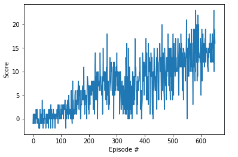

# Bananas_way: 

Navigation project by Udacity for the Deep Reinforcement Learning Nanodegree

## Introduction

For this project, the goal is to train an agent to navigate (and collect bananas!) in a large, square world. In particular, the agent has to collect as many yellow bananas as possible while avoiding blue bananas. 


For each yellow banana collected the agent gets a reward of +1, and for each blue banana collected the agent gets a reward (which is a penality in this case) of -1.

The state space has 37 dimensions and contains the agent's velocity, along with ray-based perception of objects around agent's forward direction.  Given this information, the agent has to learn how to best select actions.  Four discrete actions are available, corresponding to:
- **`0`** - move forward.
- **`1`** - move backward.
- **`2`** - turn left.
- **`3`** - turn right.

The task is episodic, that means each episode has a defined end. For this environment, the challenge is to train an agent that gets an average score of +13 over 100 consecutive episodes.

## Agent Implementation (Learning Algorithm)
The learning algorithm used is the value based method [Deep Q-Network](https://deepmind.com/research/dqn/) introduced by [Deepmind](https://deepmind.com). 

### Architecture 

As previously mentioned, the state space has 37 dimensions which is the input of our Deep Neural Network. Since we're not dealing with images, the only type of layers used is Fully Connected layers. Thus, the architecture of the network and the chosen number of layers/neurons is described as follows: 
Input layer: with 37 units (state_size=37) 
Two fully connected Hidden layers: with 128 units, 64 units respectively 
Output layer: with 4 units (action_size=4) 

Thus, the forward mapping is: 
Input layer (37 units) -> Fully Connected Layer (128 units, Relu activation) -> Fully Connected Layer (64 units, Relu activation) -> Output layer (4 units)

### Hyperparameters 

The hyperparameters used in our DQN implementation are:

- Maximum number of episodes: 2000 
- Starting value of epsilon (for epsilon-greedy action selection): 1.0
- Minimum value of epsilon: 0.01
- Epsilion decay rate (multiplicative factor for decreasing epsilon): 0.995
- BUFFER_SIZE = 100000 	  # replay buffer size
- BATCH_SIZE = 64  	  # minibatch size 
- GAMMA = 0.995           # discount factor 
- TAU = 0.001  	          # for soft update of target parameters
- LR = 0.0005             # learning rate 
- UPDATE_EVERY = 4        # how often to update the network
- Optimizer: Adam


## Results
The results presented bellow meet the project's expectation, as our agent is able to get an average reward of at least +13 over 100 episodes. This performance is reached within less than 700 episodes only (for the sake of illustrating the results, in Udacity's solution code for the project, their agent was able to solve the project in fewer than 1800 episodes).

```
Episode 100	Average Score: 0.36
Episode 200	Average Score: 3.18
Episode 300	Average Score: 7.21
Episode 400	Average Score: 6.60
Episode 500	Average Score: 9.73
Episode 600	Average Score: 12.85
Episode 652	Average Score: 14.14
Environment solved in 552 episodes!	Average Score: 14.14

```

### Plot of Rewards




## Ideas for Future Work
In this project, the agent learned from information such as its velocity, along with ray-based perception of objects around its forward direction. A more challenging task as mentioned in the Udacity nanodegree would be to learn directly from raw pixels observed in the environment. 
In such case, a Convolutional Neural Network would be suitable for the agent (CNN was used in Deepmind's [paper](https://deepmind.com/research/dqn/) about DQN). 

Additional improvements might also be considered and highly recommended to the DQN implementation. In fact, the rainbow algorithm (DQN with the 6 additional proposed improvements) would probably have far better results in both environments. 

